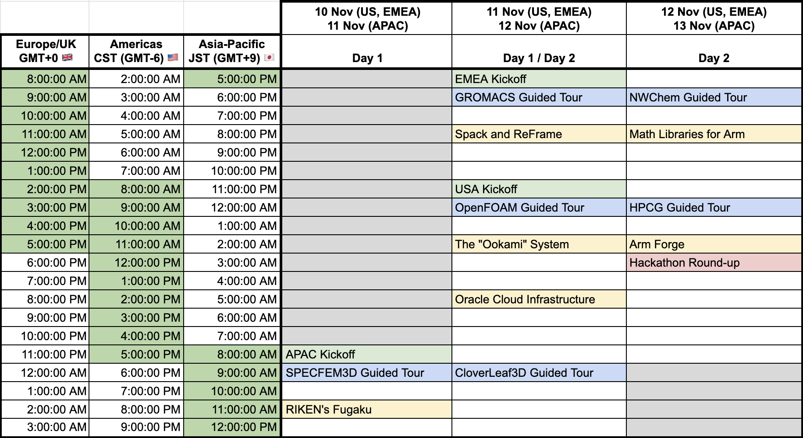

# Overview

Run your favorite HPC applications on record-setting Arm-based HPC kit at a two-day hackathon for HPC developers!  Fujitsu A64FX, AWS Graviton 2, and Oracle Cloud Infrastructure (OCI) Ampere A1 instances with Ampere Altra CPUs will be provided.  Commercially supported and open source compilers, libraries, and tools will be available with experts from Arm, NVIDIA, and the community on-hand to answer any questions.  Use any of the provided example applications to learn about today's Arm-based CPUs or bring your favorite application and work with Arm's HPC experts on porting and tuning.  

This event is generously supported by **AWS**, **OCI**, **Stony Brook University**, and **The GW4 Alliance**.  Thanks!

# Presentations and Slides

[Watch all the videos on the A-HUG Hackathon YouTube channel](https://www.youtube.com/playlist?list=PLaWQAhTtIa_pmQlEMPfl2XUpa90M2bp2a)

| Video                    | Resources                   | Presenters                    |
| ------------------------ | ------------------------ | ----------------------------- |
| [SPECFEM3D Guided Tour](https://youtu.be/SAt6tJ9IqwA) | [Slides (PDF)](https://drive.google.com/file/d/11ueDwJH0pKXy2D7WXaxrUs4M-MPMuReU/view?usp=sharing) | Fabrice Dupros, John Linford (ARM) |
| [Supercomputer Fugaku](https://youtu.be/oO5GN1kaFFc) | [Slides (PDF)](https://drive.google.com/file/d/1qQi9qtQVjAhw2ELrLuiVojoDP8PReXCp/view?usp=sharing) | Mitsuhisa Sato (RIKEN) |
| [GROMACS Guided Tour](https://www.youtube.com/watch?v=PBhTPpjn8QE) | [Slides (PDF)](https://drive.google.com/file/d/1ep07I99Fhu1lnkOuCD74DNEXZN4eejb3/view?usp=sharing) | Austin Cherian (AWS) | 
| [Spack and ReFrame](https://www.youtube.com/watch?v=E5bwCtRZmRQ) | [Slides (PDF)](https://drive.google.com/file/d/18CKvnNnP9JwVLKv4k2vzJ96JwAqNKz95/view?usp=sharing) | Olly Perks (Arm) | 
| [OpenFOAM Guided Tour](https://youtu.be/RuiwsnPkoic) | [Slides (PDF)](https://drive.google.com/file/d/1CRwht3mg1Uw47WENE0TOY3pys2pJHUm1/view?usp=sharing) | Olly Perks (Arm) |
| [Stony Brook's Ookami System](https://youtu.be/DoBDe2plgI8) | [Slides (PDF)](https://drive.google.com/file/d/1YhXn9tSrnEld6ecUKozFD3kTztXBd-ph/view?usp=sharing) | Eva Siegmann (Stony Brook) |
| [Oracle Cloud, Arm, and HPC](https://www.youtube.com/watch?v=_dDMn1ckqhQ) | [Slides (PDF)](https://drive.google.com/file/d/174mBZuXlwBN4U714MEIi4_1wu6MaMFZj/view?usp=sharing) | Kevin Jorissen (OCI) |
| [CloverLeaf3D Guided Tour](https://youtu.be/CTTclw1O-EY) | Coming soon | Srinath Vadlamani (Arm) |
| [NWChem Guided Tour](https://youtu.be/GJ_oubwXUXA) | [Slides (PDF)](https://drive.google.com/file/d/1OCdlCRWeEXkJ9hRIoH07FwZFCElE1TEK/view?usp=sharing) | Jeff Hammond (NVIDIA) |
| [Math Libraries for Arm](https://youtu.be/gzwq3iCP4mE) | [Slides (PDF)](https://drive.google.com/file/d/1joHHe_GnlsDBaUx6rhHUDJIFtWVFaCw2/view?usp=sharing) | Chris Goodyer (Arm) |
| [HPCG Guided Tour](https://youtu.be/BlrjZWmCBdU) | [Slides (PDF)](https://drive.google.com/file/d/1LybFIwvWpt-QgOz2ByNxS6kns22CplrZ/view?usp=sharing) | Lucas Pettey (Arm) |
| [Arm Forge](https://youtu.be/J7a5TmwAtKw) | [Slides (PDF)](https://drive.google.com/file/d/1xGC7uvUvWECS6YbswpZTLy8GNkfjrF8y/view?usp=sharing), [Resources (PDF)](https://drive.google.com/file/d/1Mvj26VjPoy6L7Lc6V55RoCPH6-iEUI5t/view?usp=sharing) | Beau Paisley, Andrew Westergren (Arm) |

# Schedule and Logistics

The event will kick off on 11 November at **8:00am JST, 8:00AM BST, and 8:00AM CST** with cluster login 
instructions and an overview of the assorted Arm HPC systems available at this event.
Our schedule includes a mix of talks, guided tours of HPC applications, and free time to hack.
        
 * **Registration**: [Register via EventBrite](https://www.eventbrite.com/e/arm-hpc-users-group-sc21-hackathon-registration-189172338557)
 * **Hands-on Materials**: [https://github.com/arm-hpc-user-group/SC21-Hackathon](https://github.com/arm-hpc-user-group/SC21-Hackathon)
 * **Communication**: A Zoom meeting link will be provided to the registered attendees. *Please make sure that you have updated to the latest version of Zoom.*  [See this help article for instructions](https://support.zoom.us/hc/en-us/articles/201362233-Upgrade-update-to-the-latest-version).
 * **System Access**: Login details will be provided on the day of the event.  We will be using multiple Arm-based HPC systems including:
   * AWS Gravition 2 instances
   * OCI Ampere A1 instances with Ampere Altra CPUs
   * Stony Brook University's [_Ookami_](https://www.stonybrook.edu/commcms/ookami/) supercomputer.
   * University of Bristol's [_Isambard 2_](https://gw4-isambard.github.io/docs/), [the largest Arm-based supercomputer in Europe](https://insidehpc.com/2020/02/isambard-2-at-uk-met-office-to-be-largest-arm-supercomputer-in-europe/).

# Contact

 * John Linford <john.linford@arm.com>
